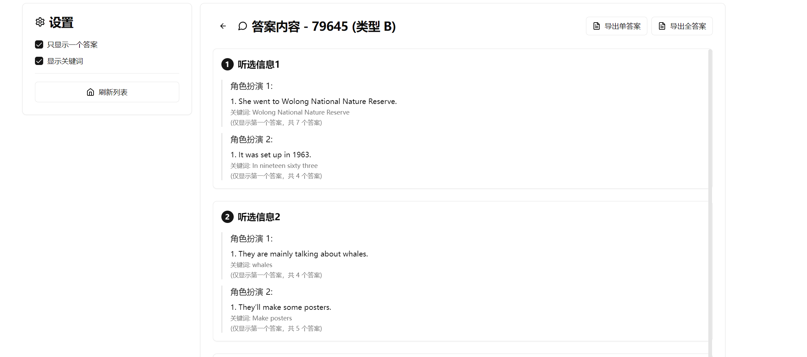

# ETS 答案查看器

一个基于 Electron 开发的 Windows 桌面应用程序，用于查看 ETS 作业/考试的答案。

## 注意事项

> **听说成绩考不好就不要怪我咯啊，我自己有把握滴...**  

## 系统要求

- 仅支持 Windows 操作系统
- ETS客户端

## 使用前提

在使用本软件前，请确保：
1. **已打开 ETS 客户端**
2. **已加载好需要查看答案的作业/考试页面**

## 使用方法

1. 下载并运行本软件
2. 确保 ETS 客户端加载完成需要的作业
3. 在软件界面中找到对应的作业/考试
4. 点击查看答案即可显示相关内容

## 软件界面

